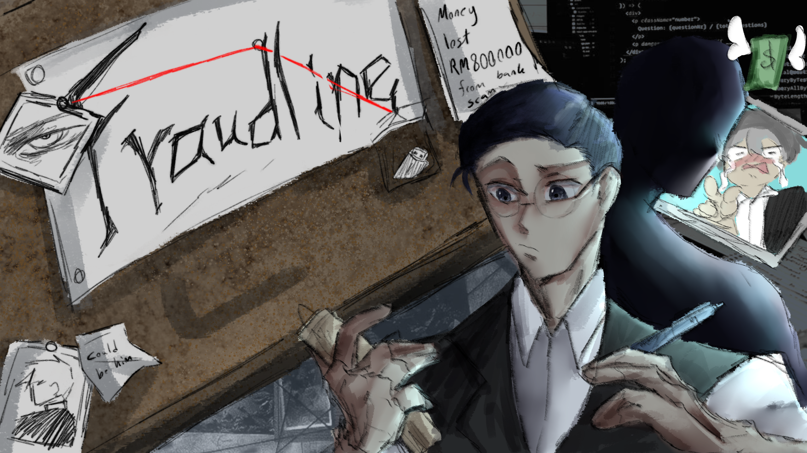
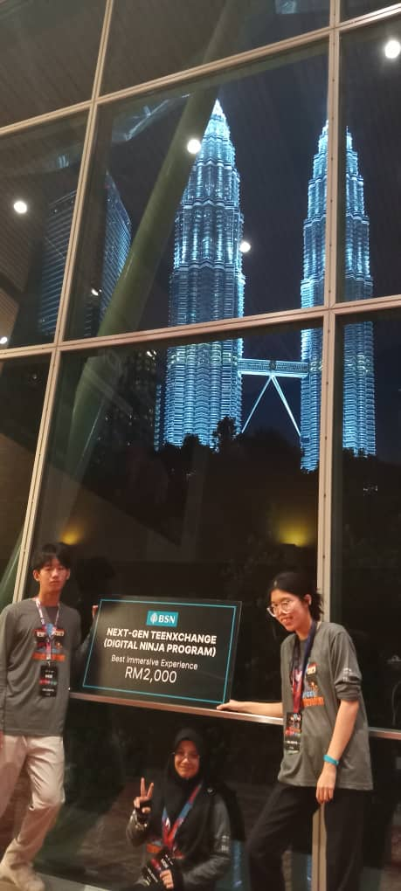
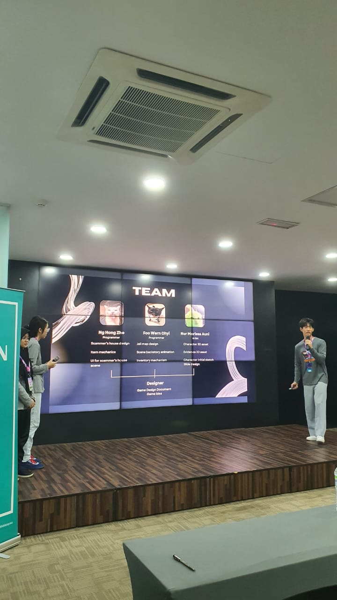
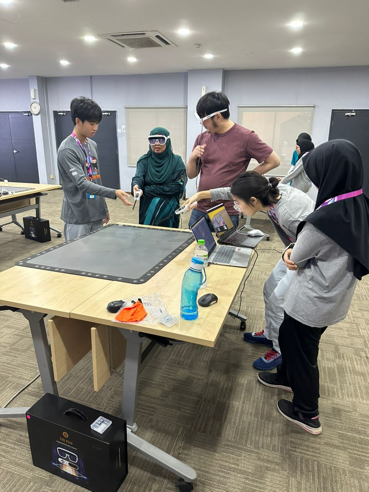
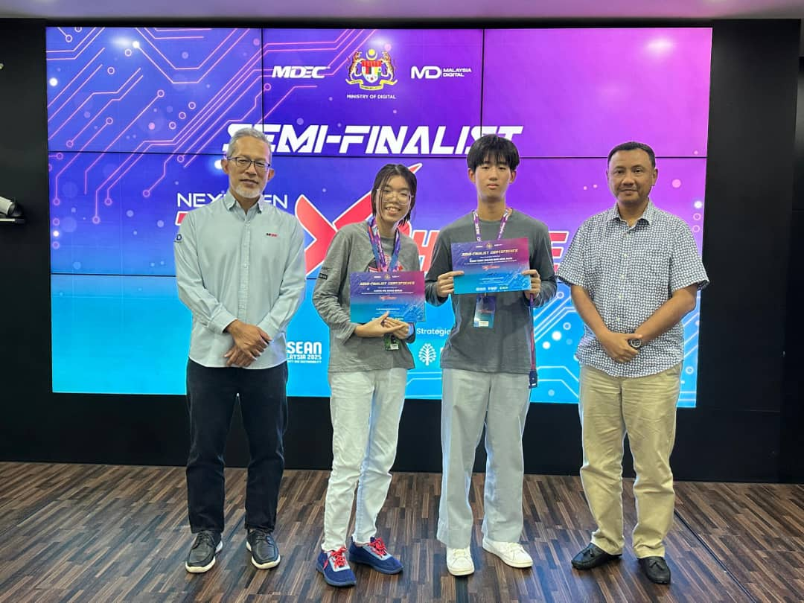
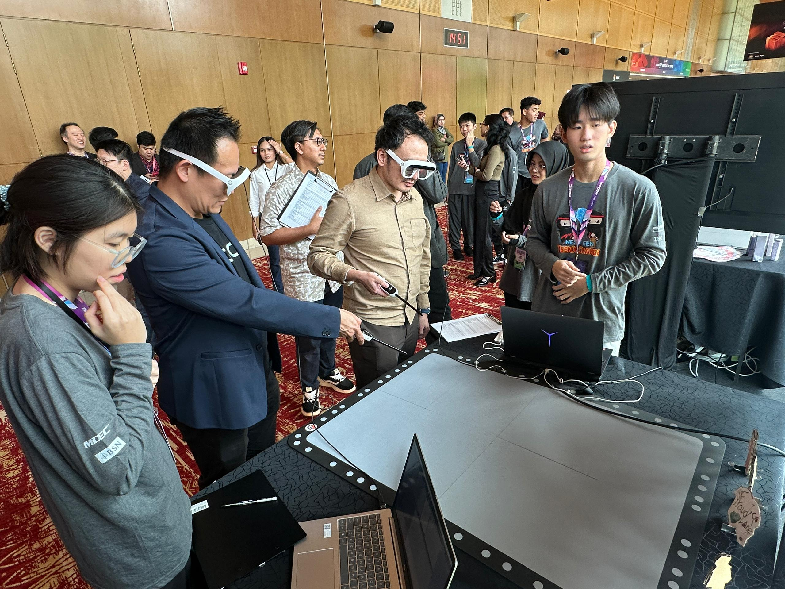

<h1 align="center">🎮 Fraudline</h1>

  <em>A two-month game project exploring game design, storytelling, and programming concepts.</em> 
  Focused on <b>decision-making</b>, <b>strategy</b>, and <b>uncovering hidden truths</b> in a world of deception.

   
  🎥 <em>Click the image above to watch the demo</em>

---

## 🚀 Features
- 🎭 <b>Engaging narrative</b> centered on fraud and deception  
- 🧠 <b>Player choices</b> that shape multiple story outcomes  
- 🔁 <b>Simple yet addictive</b> gameplay loop  
- 🕶️ <b>Experimental Tilt Five VR integration</b> for immersive play  

---

## 🛠️ Tech Stack
| Component | Details |
|------------|----------|
| **Language** | C# |
| **Engine** | Unity |

---

## 👩‍💻 Developers
| Role | Name |
|------|------|
| 🎨 Artist | Marissa |
| 💻 Programmer | Wern Chyi |
| 💻 Programmer | Hong Zhe |

---

## 🏆 Project Background
Fraudline began during the **Next Gen Teen Exchange Semi-Finalist Camp/Competition**.  
Our team advanced to the **Final Round** and presented the game to a large audience at **MDEX 2025**.

---

## 📸 Development Gallery  

  <!-- Row 1: two portrait photos -->

  
  
  

  <!-- Row 2: one landscape -->
  

    
  

  <!-- Row 3: two portrait/landscape mix -->
  

    
  

